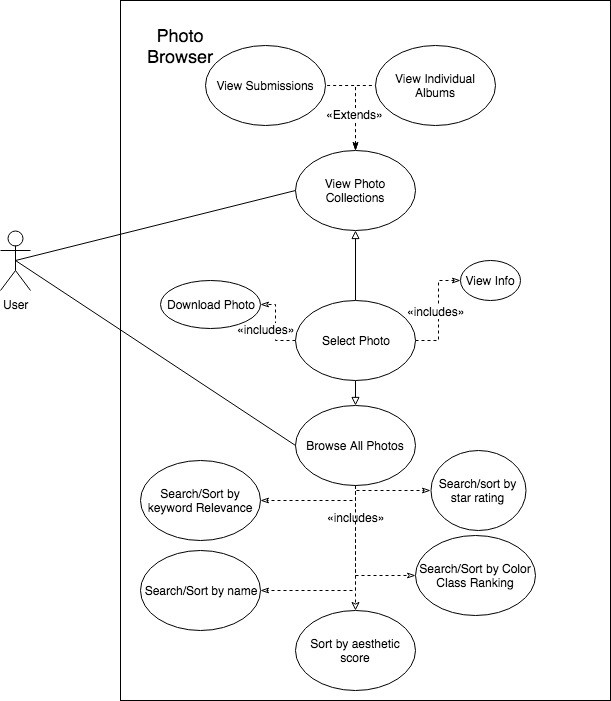

# Sprint 1 Design Document Template

## Deployment Environment

[Link to your deployment environment](http://rji.glike.cf)

## Functional Requirements


1. User File Management


User File Management has not been implemented into an interface as of right now. Currently, files are stored and manipulated on the file system via SQL (a more efficient method of manipulation for photographs over 1MB in size), but manipulation via the website has not been managed. Instead, file manipulation is only possible through uploads via the website, and through manually changing file names and locations with SSH.

2. Image Assessment	


Image assessment has begun using one of the example python image assessment libraries provided. This has given us a good jumping off point, both for a reference point when it comes to a more complex image assessment algorithm later on, and allowing us to test and get a feel for how this implementation will operate within a server. Currently, we project a change with when image assessment will occur - we plan to have images be assessed as they are uploaded, instead of having to separately initiate uploading and assessment.

3. Photo Browser



The photo browser, like File Management, has not been implemented - however, this will be a much easier task than full File Management. Once File Assessment has been worked on further, we will utilize the website to display uploaded images and their associated rankings.

4. Train Model


Currently, the Train Model portion of the project is the already-implemented library, expounded upon in Image Assessment. As a result, training has not occurred yet. When training is implemented, we will not have one singular ‘trained’ model, but will train multiple models based on the images classification - Football, Crowd, etc. As a result, image assessment will occur in two layers - classification, to associate an image with its best-suited model, and actual assessment, to provide a rating based on images in the same category.

Current Implementation:

Our current implementation is utilizing Amazon AWS for the image assessment and storage library. Currently, we have implemented a basic website that allows for users to upload images. In addition, we have set up an image assessment library and seeded it with dummy data to test its capabilities. We have also implemented a basic database schema, and have stored our files using the Filestream functionality SQL has. 


## Database Design

### ERD


### DDL 

```SQL

    CREATE TABLE `Images` (
    `ImageID` int(10) UNSIGNED NOT NULL AUTO_INCREMENT,
    `FilePath` varchar(60) NOT NULL UNIQUE,
    `UploadDate` date NOT NULL,
    `UploaderID` varchar(12) NOT NULL,
    `AestheticScore` float UNSIGNED NULL,
    `TechnicalScore` float UNSIGNED NULL,
    PRIMARY KEY (`ImageID`) 
    );
    CREATE TABLE `Users` (
    `UserID` varchar(12) NOT NULL,
    `Password` varchar(12) NOT NULL,
    `FullName` varchar(30) NULL,
    `PermissionLevel` int(1) UNSIGNED NOT NULL DEFAULT 0,
    PRIMARY KEY (`UserID`) 
    );

    ALTER TABLE `Images` ADD CONSTRAINT `fk_Photo_User_1` FOREIGN KEY (`UploaderID`) REFERENCES `Users` (`UserID`);
    
%% ETC
```    


### User Interface Files

[Main Interface](./index.html)


### Model Files (Database Access)

[Model](https://github.com/computationalmystic/RJI-group1/tree/model) 

[SQL](./image_assessment_schema.sql)


### Controller Files (API or other)

[Image Upload](./upload.php)

[Aesthetic Score](./getScoreAesthetic.sh)

[Technical Score](./getScoreTechnical.sh)


## Describe languages you need to use, and any gaps in skills on your team. 

1. Python
    - used with docker as a framework for machine learning based image assessment
2. PHP/CSS/HTML 
    - used as user interface and to communicate with database using mySQL
3. SQL
    - main DDL used to store image data with scores as well as user data
    
4. Language Proficiency
    - Gavin: work with python and docker
    - Chase: database definition, PHP
    - Allan: help with database
    - John: help with docker

